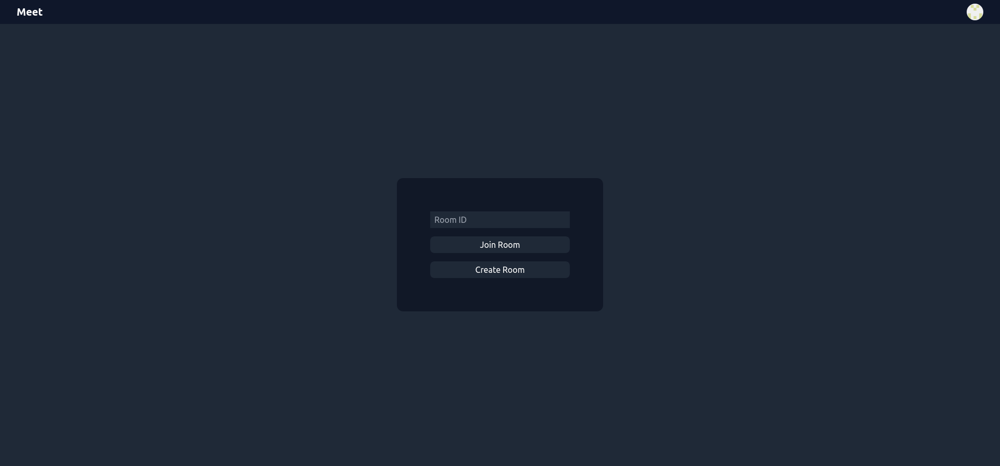
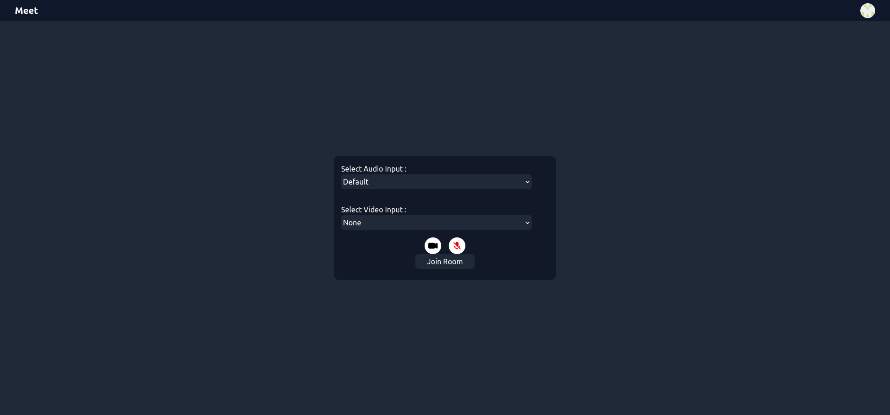
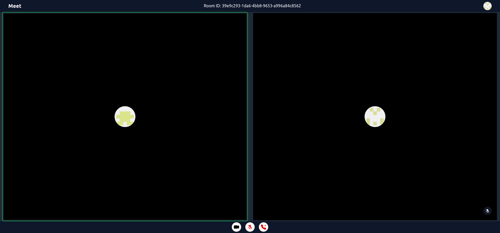

# Meet

One-To-One Video/Audio call app built with WebRTC, Go Fiber, Solid JS, TailwindCSS and uses github oauth.

## Images




## To Run

### Server

`cd server`

#### Example `.env`
```
export CLIENT_ID="github_oauth_client_id"
export CLIENT_SECRET="github_oauth_client_secret"
```

##### Build
```
go get .
go build
```

##### Run
```
source .env
./Meet
```

### Client

Change `oauth_url` in `/web/src/Components/Topbar.tsx`

`cd web`

##### Build
```
npm ci
npm build
```

##### Run
```
serve dist
```
